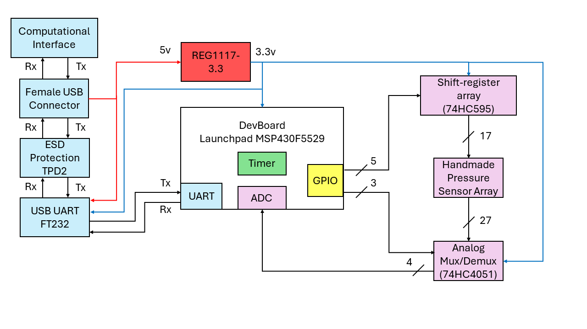
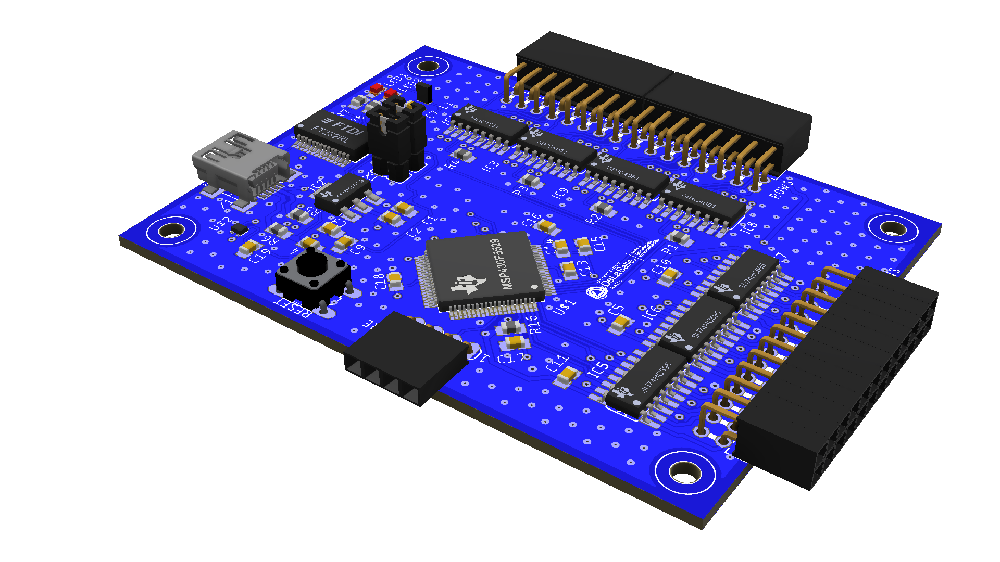

# Baropodometry

1. **Printed Circuit Board:** 3D renders
    ~~~
    Electronic CAD: Autodesk EAGLE
    Computer-Aided Design Software: Fusion360

	1. Schematic Diagram
	2. CAD Model
	3. Renders
    ~~~
2. **Microcontroller:** Programming embedded system to acquire and visualize static plantar load distribution.
    ~~~
    Embedded System: MSP430-F5529 Launchpad
    Manufacturer:Texas Instruments 
    General specifications: 25 MHz MCU with 128KB Flash, 8KB SRAM
    ~~~

**Features applied:**
  1. GPIO pins
  2. Timer_A0
  3. 12-bit ADC
  4. UART protocol
  5. Interrupts

## Credits
I would like to express special thanks to the following users on GrabCAD for their CAD models:

  1. Female Headers By DL2DW - Dirk Wouters
  2. Jumpler By DL2DW - Dirk Wouters
  3. Male Headers By - Vahagn Zargaryan
  4. Mini USB By [Unknown]
